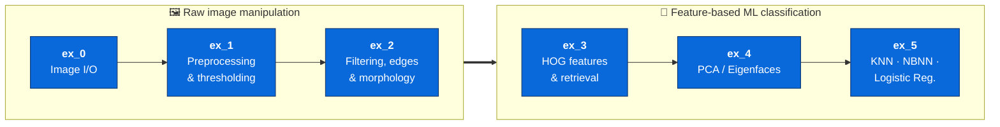
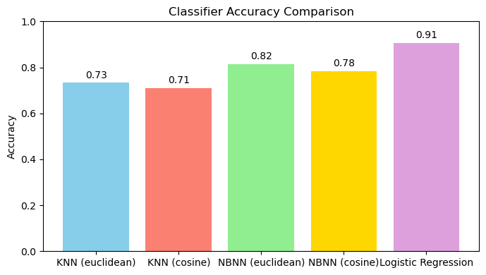

# Introduction to Machine Learning — from pixels to classifiers

> A hands-on journey through classical computer vision and machine learning, built **from scratch with NumPy**. No black boxes: every convolution, edge, gradient histogram, eigenvector, and nearest neighbour is implemented by hand.

This repository collects six graded exercises from the *Introduction to Machine Learning* course (Pattern Recognition Lab). Each exercise is a self-contained mini-project with an instruction sheet, a reference implementation, a test suite, and — for the later ones — exploratory notebooks and generated plots.

The exercises are deliberately ordered as a **learning arc**: they start with raw pixel manipulation and end with training and comparing real classifiers. The recurring rule across the course is *"implement it yourself"* — library shortcuts such as `cv2.HOGDescriptor`, `sklearn.decomposition.PCA`, or pre-built nearest-neighbour helpers are explicitly off-limits, so the math is always visible in the code.

---

## The arc



| # | Exercise | Theme | Key techniques (all hand-written) |
|---|----------|-------|-----------------------------------|
| **0** | [Warm-up](ex_0) | Image I/O & manipulation | Color-space conversion, grayscale (lightness/average/luminosity), rotation & flip via slicing, center crop, resize |
| **1** | [Preprocessing](ex_1) | Noise, contrast, thresholding | Gaussian / salt-&-pepper / Poisson / uniform noise, histogram equalization (CDF remap), **Otsu** between-class-variance thresholding |
| **2** | [Filtering & edges](ex_2) | Convolution, Canny, morphology | 2D convolution + Gaussian kernels + unsharp masking, full **Canny edge detector**, binary erosion/dilation/opening/closing |
| **3** | [HOG features](ex_3) | Feature extraction & retrieval | **Histogram of Oriented Gradients** (cell histograms, block L2-Hys normalization), MSE/Euclidean distances, symbol alignment (bounding box → crop → center) |
| **4** | [Eigenfaces](ex_4) | Dimensionality reduction | **PCA via SVD** by hand, average face, reconstruction from top-k components, standardization, classification with Logistic Regression & Gaussian Naive Bayes |
| **5** | [Nearest neighbours](ex_5) | Instance-based vs. linear classifiers | **KNN** & **NBNN** from scratch (Euclidean + cosine), NumPy-only confusion matrix, comparison against sklearn **Logistic Regression** |

---

## Exercise highlights

### ex_0 — Image I/O warm-up
An `ImageProcessor` class that loads images (BGR/RGB/gray), converts color spaces through channel indexing, and performs geometric operations (rotate, flip, crop, resize) with manual NumPy indexing rather than one-line library calls.

### ex_1 — Preprocessing & thresholding
Four noise models, histogram equalization via the cumulative distribution function, and **Otsu's method** — finding the global threshold that maximizes between-class variance — all reconstructed from their definitions.

### ex_2 — Convolution, Canny & morphology
A "slow" but transparent 2D convolution (zero-padding + kernel flipping), the complete **Canny pipeline** (Gaussian smoothing → Sobel gradients → magnitude/direction → non-maximum suppression → hysteresis), and the four binary morphological operators built on sliding-window views.

### ex_3 — Histogram of Oriented Gradients
A from-scratch **HOG descriptor**: Sobel gradients, unsigned orientation binning with linear interpolation, block grouping, and L2-Hys normalization — then used with distance measures to retrieve rotated **Kaktovik numeral** images. (`cv2.HOGDescriptor` is forbidden.) See the [reference video](ex_3/README.md).

### ex_4 — Eigenfaces
**PCA computed by hand via SVD** on the Yale face database: compute the average face, extract eigenfaces, project and reconstruct faces from the top-k components, then classify the reduced features with Logistic Regression and Gaussian Naive Bayes.

### ex_5 — KNN, NBNN & Logistic Regression
A small common classification interface over three approaches on the **Kaktovik symbol** dataset (11 classes, 2882 train / 968 test images). KNN and NBNN are implemented from scratch with both Euclidean and cosine distance; the confusion matrix uses NumPy only.

**Results on the full test split:**

| Classifier | Accuracy |
|------------|----------|
| KNN (euclidean) | 0.734 |
| KNN (cosine) | 0.710 |
| NBNN (euclidean) | 0.770 |
| NBNN (cosine) | 0.755 |
| **Logistic Regression** | **0.907** |

<p align="center">
  <br>
  <em>Logistic Regression clearly beats the instance-based methods; Euclidean and cosine behave almost identically. Full write-up in <a href="ex_5/DISCUSSION.md">ex_5/DISCUSSION.md</a>.</em>
</p>

---

## Getting started

### 1. Create and activate a virtual environment

```shell
python3 -m venv .venv
source .venv/bin/activate       # Windows: source .venv/Scripts/activate
```

### 2. Install dependencies

```shell
pip install -r requirements.txt
```

This installs everything the repo uses: `numpy`, `opencv-python`, `matplotlib`, `scikit-learn` (Logistic Regression / Gaussian Naive Bayes in ex_4 and ex_5), `Pillow`, and `scipy`.

---

## Running the exercises

Most exercises run directly from inside their own folder, e.g.:

```shell
cd ex_2 && python test_convo.py
cd ex_4 && python Main.py
```

**Exercise 5 is packaged** (its modules import each other as `ex_5.*`), so it must be run from the **repository root**:

```shell
# from the repo root
python -m pytest ex_5/test_Ex5.py     # run the test suite
python -m ex_5.main                   # run the full evaluation pipeline
```

A convenience script does both for you and handles the working directory automatically:

```shell
./ex_5/run.sh
```

Running the ex_5 pipeline regenerates all plots into [`ex_5/outputs/`](ex_5/outputs): 11 nearest-neighbour visualizations, five confusion matrices, and the accuracy comparison chart.

---

## Repository layout

```
IntroML/
├── ex_0/   Image I/O warm-up            (ex0.py, ex0_test.py, ex0.ipynb)
├── ex_1/   Preprocessing & Otsu         (noise, histogram_equalization, otsu + tests + notebooks)
├── ex_2/   Convolution / Canny / morph. (convo, CannyEdgeDetector, morphological + tests + notebooks)
├── ex_3/   HOG features & retrieval     (HOGFeature, DistanceMeasure, kaktovikAlignmentSimple + notebooks)
├── ex_4/   Eigenfaces (PCA)             (Eigenfaces.py, Main.py + Yale face data)
├── ex_5/   KNN / NBNN / LogReg          (knn, nbnn, logistic_regression, evaluation + Kaktovik data + outputs)
├── requirements.txt
└── README.md
```

Every exercise ships with its original **PDF instruction sheet** and at least one **test file** (`test_*.py`). The later exercises keep exploratory work and written discussions in a `notebooks/` subfolder.

---

## Datasets

- **Yale face database** (ex_4) — grayscale face images organized by subject, used for the Eigenfaces PCA pipeline.
- **Kaktovik numerals** (ex_3, ex_4, ex_5) — a base-20 Iñupiaq numeral system whose clean, stroke-based glyphs make an approachable symbol-classification benchmark. Exercise 5 uses the full 11-class split; exercise 4 uses a curated 8-class subset (see [ex_4/kaktovik/README.md](ex_4/kaktovik/README.md)).

---

## Notes

- The guiding constraint throughout is **implement the algorithm, don't call it** — high-level CV/ML helpers are intentionally avoided so the underlying math stays in the code.
- Test suites document the expected interface and edge-case behaviour of each implementation; they are the quickest way to understand what a module is supposed to do.
