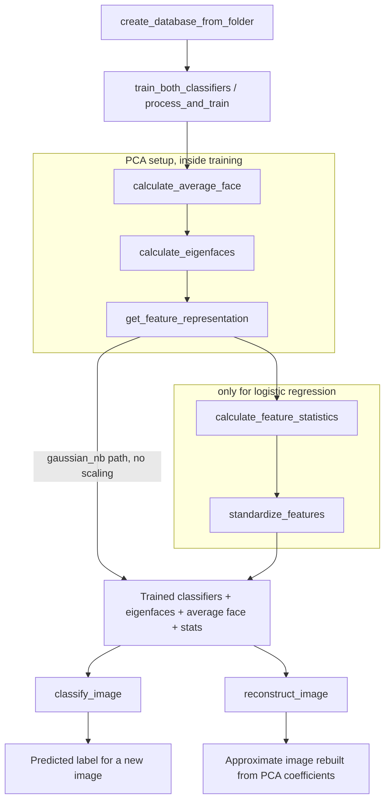

# Eigenfaces Pipeline — Concepts, Formulas, and Function Roles

This document explains the ideas behind the pipeline, the math behind each step, and what each function contributes — enough to understand the whole exercise without reading the code line by line.

## The pipeline in one sentence

Load images → flatten them → find the directions of most variation (PCA/eigenfaces) → represent each image as a short list of coefficients along those directions → train a classifier on those coefficients → use the same steps to classify or reconstruct new images.

---

## Core concepts and formulas

### 1. Representing an image as a vector

An image of height $h$ and width $w$ is a grid of pixel intensities. Flattening turns it into a single vector:

$$x \in \mathbb{R}^{d}, \quad d = h \times w$$

A dataset of $n$ images becomes a matrix:

$$X \in \mathbb{R}^{n \times d}$$

where each row is one flattened image. This is what `create_database_from_folder` produces. Once images are vectors, all the machinery of linear algebra and standard classifiers becomes applicable — PCA, SVD, logistic regression, and Naive Bayes are all defined in terms of vectors, not 2D grids.

### 2. The average image (centering)

$$\bar{x} = \frac{1}{n}\sum_{i=1}^{n} x_i$$

This is a single vector of length $d$ — computed by `calculate_average_face`. Centering means subtracting it from every image:

$$\tilde{x}_i = x_i - \bar{x}$$

Why center at all? PCA is about finding directions of *variation*. If you don't subtract the mean first, the dominant "direction" PCA finds is just "images are bright / have a face-like shape in general," which isn't useful for telling images apart. Centering removes that shared baseline so PCA can focus on what actually differs between images.

### 3. PCA and the covariance matrix (the idea, before the shortcut)

Conceptually, PCA finds the directions along which the centered data $\tilde{X}$ (rows = centered images) varies the most. This is done by looking at the covariance matrix:

$$C = \frac{1}{n} \tilde{X}^\top \tilde{X} \in \mathbb{R}^{d \times d}$$

The eigenvectors of $C$, sorted by their eigenvalues (largest first), are the principal directions — the ones capturing the most variance. This is the classical definition of PCA. But for images, $d$ (number of pixels) can be huge — for $64\times64$ images, $d = 4096$, so $C$ would be $4096 \times 4096$. Computing and diagonalizing that directly is expensive.

### 4. Getting the same answer via SVD (the actual shortcut used)

Singular Value Decomposition factorizes any matrix as:

$$\tilde{X} = U S V^\top$$

where:
- $U \in \mathbb{R}^{n \times k}$, columns are orthonormal (directions in "image space")
- $S \in \mathbb{R}^{k}$, singular values, sorted largest to smallest
- $V^\top \in \mathbb{R}^{k \times d}$, rows are orthonormal (directions in "pixel space")
- $k = \min(n, d)$

The key fact PCA relies on: the rows of $V^\top$ are exactly the eigenvectors of the covariance matrix $C$ from step 3, and the singular values relate to the eigenvalues by $\lambda_i = S_i^2 / n$. So instead of building the huge $d \times d$ covariance matrix, `calculate_eigenfaces` runs SVD directly on the small-ish $\tilde X$ ($n \times d$, where usually $n \ll d$) and reads the principal directions straight off $V^\top$. This is mathematically identical to classical PCA, just computed a cheaper way.

The **eigenfaces** are the first $m$ rows of $V^\top$ (the $m$ directions with the largest singular values):

$$W = V^\top_{1:m} \in \mathbb{R}^{m \times d}$$

$m$ is `num_eigenfaces` — how many components you decide to keep.

### 5. Projecting an image into PCA space (feature extraction)

Given an image $x$, its PCA coefficients ("features") are found by projecting the centered image onto each eigenface direction:

$$z = W (x - \bar{x}) \in \mathbb{R}^{m}$$

This is what `get_feature_representation` computes for a whole batch of images at once. Instead of $d$ pixel values, each image is now described by $m$ numbers ($m \ll d$ typically) — a compressed representation that keeps most of the meaningful variation.

### 6. Reconstructing an image from its coefficients

Going back from coefficients to (approximate) pixels:

$$\hat{x} = \bar{x} + W^\top z$$

Because $W$'s rows are orthonormal, this is the best possible linear reconstruction using only $m$ directions — it minimizes the squared reconstruction error among all rank-$m$ approximations (this is the Eckart–Young theorem, the same result that underlies truncated SVD). The more components $m$ you keep, the closer $\hat{x}$ gets to the original $x$; at $m = k$, reconstruction is exact. `reconstruct_image` implements this formula.

### 7. Feature standardization (z-scoring)

For each PCA feature (column) $j$, computed over the training set:

$$\mu_j = \text{mean of feature } j, \qquad \sigma_j = \text{std of feature } j$$

Then every value of that feature is rescaled:

$$z_j' = \frac{z_j - \mu_j}{\sigma_j}$$

This is what `calculate_feature_statistics` (computes $\mu_j, \sigma_j$) and `standardize_features` (applies the formula) do. The reason this matters: PCA coefficients naturally have very different scales — the first component usually has much larger variance than the tenth. Logistic regression's optimizer converges faster and behaves better when all input features are on a comparable scale. A key rule: $\mu_j$ and $\sigma_j$ are always computed **once**, from training data only, and reused unchanged on any new/test image — otherwise you'd be "cheating" by letting test data influence its own scaling, and results would not reflect real-world performance.

### 8. The two classifiers, briefly

**Logistic Regression** models the probability of each class as a (softmax-generalized) sigmoid of a linear combination of the input features:

$$P(y = c \mid z') = \text{softmax}(W_c z' + b_c)$$

It learns weights $W_c, b_c$ per class by maximizing the likelihood of the training labels. It draws (soft) linear decision boundaries in PCA-feature space.

**Gaussian Naive Bayes** takes a completely different approach: for each class $c$, it assumes every feature is independently Gaussian-distributed, and estimates a mean and variance per feature per class directly from training data:

$$P(z_j \mid y=c) = \mathcal{N}(z_j; \mu_{c,j}, \sigma_{c,j}^2)$$

Classification then uses Bayes' rule to pick the class maximizing $P(y=c) \prod_j P(z_j \mid y=c)$. Because it assumes features are independent given the class, correlated PCA coefficients (which is common, since PCA components can still interact through the classes) can hurt its accuracy compared to logistic regression — a good candidate observation for Exercise 4.

---

## Data loading

**`create_database_from_folder`**
Reads all images from the dataset folder structure (one subfolder per class), resizes them to a fixed size, and flattens each into a single row of numbers. Produces the raw data matrix everything else operates on, plus the corresponding class labels. You're told not to modify this one — it's just the entry point.

**`_list_class_directories`** (helper)
Finds the class subfolders inside the dataset folder. Supports `create_database_from_folder`; not something you call directly.

**`_build_classifier`** (helper)
Given a name like `"logistic"` or `"gaussian_nb"`, returns a fresh, untrained sklearn classifier of that type. Centralizes classifier creation so it isn't duplicated across functions.

**`_uses_feature_scaling`** (helper)
A small rule: only logistic regression needs standardized features; Gaussian Naive Bayes doesn't. Used to decide which branch of logic to take in the training/classification functions.

---

## PCA / "eigenfaces" computation

**`calculate_average_face`**
Computes the "typical" image — the pixel-by-pixel average across the whole training set. This is the reference point everything else is measured against (how much does *this* image differ from the average?).

**`calculate_eigenfaces`**
The heart of the PCA step. Finds the principal directions of variation across the training images — the "eigenfaces." Each one captures a pattern of variation shared across many images (e.g., overall lighting, face shape, stroke thickness for symbols). Together, a handful of these directions can approximate most of what makes images in the dataset different from each other.

**`get_feature_representation`**
Converts an image into a short list of numbers (its "PCA coefficients") describing how much of each eigenface direction is present in it. This is the compressed representation used everywhere downstream — instead of thousands of pixels, each image becomes, say, 20–50 numbers.

**`reconstruct_image`**
The reverse of the step above: takes an image's PCA coefficients and rebuilds an approximate version of the original image from them. Used to visually check how much information is preserved when you keep only a subset of components.

---

## Feature standardization

**`calculate_feature_statistics`**
Measures the average value and spread (mean/std) of each PCA coefficient across the training set. This is a bookkeeping step preparing for standardization — not the standardization itself.

**`standardize_features`**
Rescales PCA coefficients so they're all on a comparable numeric scale (roughly centered at zero, unit spread). Logistic regression trains better this way. Crucially, the same mean/std learned from training data gets reused on any new image later — a new image is never allowed to define its own scale.

---

## Training

**`process_and_train`**
Runs the full pipeline for *one* classifier: compute average face → eigenfaces → PCA features → (standardize if needed) → train the classifier. Stores the trained classifier and its standardization stats so they can be reused later for classifying new images.

**`train_both_classifiers`**
Same idea, but trains logistic regression *and* Gaussian Naive Bayes on one shared PCA representation, so the two classifiers can be fairly compared on identical features. This is what lets Exercise 3 compare the two models side by side.

---

## Inference

**`classify_image`**
Takes a single new image, projects it into the same PCA space used during training, applies the same standardization (if the classifier needs it), and asks the already-trained classifier to predict its label. This is the "use the trained model" step — everything before it was setup and training.

---

## How it all connects

